# SCS-RG · Smart Campus Safety & Risk Grid

Developed by **Team Clover**:

* **Live Web Dashboard URL:** [https://clover-scs-rg.vercel.app/](https://clover-scs-rg.vercel.app/)
* **Production Live API Base URL:** [https://robofusion-techathon-teamclover.onrender.com](https://robofusion-techathon-teamclover.onrender.com)
* **System Documentation (LaTeX Source):** [docs/system_documentation.tex](docs/system_documentation.tex)

| Name | University | GitHub / Portfolio |
| :--- | :--- | :--- |
| **Sadman Islam** | Metropolitan University | [GitHub: amisadman](https://github.com/amisadman) |
| **Shah Samin Yasar** | Metropolitan University | [Portfolio](https://shahsaminyasar.vercel.app/) |
| **Ahmed Thousif Thisham** | Metropolitan University | [Portfolio](https://ahmedthousifportfolio.vercel.app/) |

---

## Project Overview & System Description

**SCS-RG (Smart Campus Safety & Risk Grid)** is a production-grade, multi-hazard IoT emergency response and campus risk management platform. Built to safeguard critical campus infrastructure (such as server rooms, research laboratories, and data centers), SCS-RG combines real-time hardware telemetry ingestion, multi-hazard risk fusion, automated incident dispatching, predictive AI risk analysis, and dual-channel safety alerting.

### Key Capabilities & Architectural Highlights
- **Bounded Multi-Hazard Risk Fusion Engine**: Real-time evaluation of Flame, Gas, Water, and Occupancy signals ($w_{\text{fire}}=40, w_{\text{gas}}=40, w_{\text{water}}=30, w_{\text{occ}}=25$ capped at 100.0) with dynamic 12-bit ESP32 vs 10-bit Arduino ADC scaling and $N=3$ flame debounce filters.
- **Atomic Priority Dispatch Queue**: Dynamic sorting of open incidents by `peak_risk_score` (DESC) -> `occupied` (DESC) -> `seconds_open` (DESC) with concurrency-safe single-write incident acknowledgments (`WHERE acknowledgedBy IS NULL`).
- **Short-Term Risk Trend Analyzer (Bonus 2)**: Rolling 5-reading slope calculation classifying zone trends into `RISING`, `FALLING`, or `STABLE`.
- **Logistic Regression ML Risk Predictor (Bonus 3)**: Isolated advisory Sigmoid model ($P(\text{Critical}) = \frac{1}{1 + e^{-z}}$) estimating 5-minute failure probability without touching hardware actuation circuits.
- **Natural-Language Incident Reporting Input (Bonus 4)**: Natural language parsing engine extracting structured hazard signals from free-text reports, validated against known campus zones and fed directly into the priority queue with source provenance tags (`"Sensor"`, `"Manual Override"`, `"NL Report"`).
- **Dual-Theme Adaptive Command Console**: Built with Next.js 16, Tailwind CSS, shadcn/ui, and Recharts analytics charts, featuring an instant light/dark mode theme toggle and real-time WebSocket updates.

---

## System Architecture Diagram

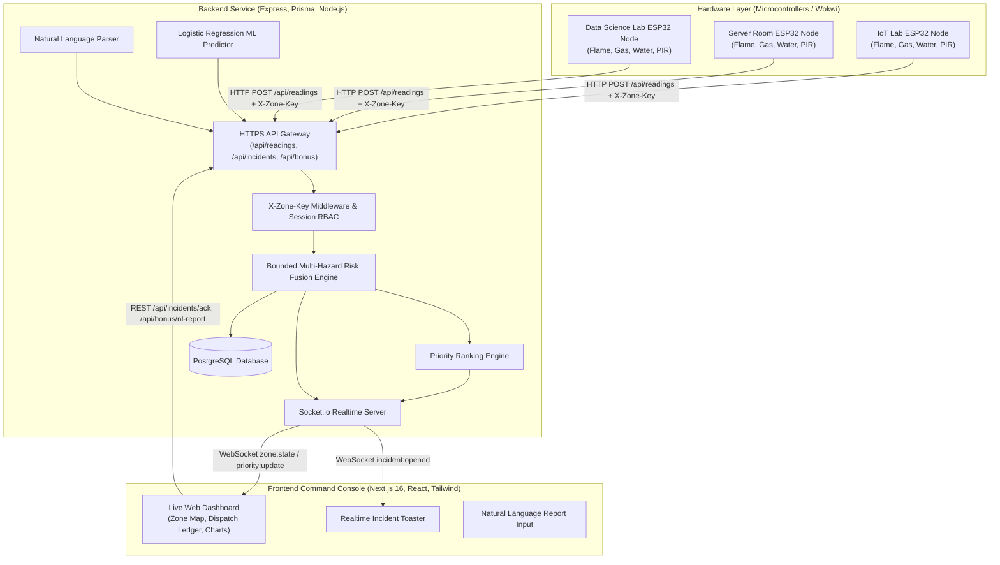

---

## Database Schema Design

The SCS-RG backend uses PostgreSQL with Prisma ORM. Key entity relationships:

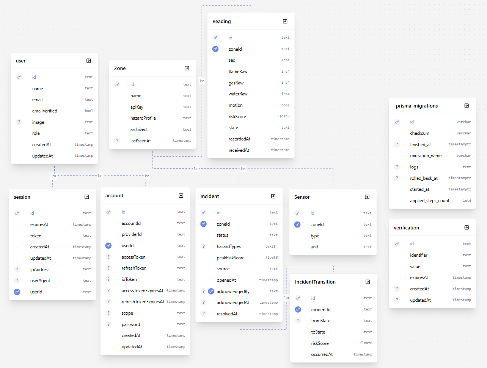

---

## Hardware Sensor Circuit Diagrams (Per Zone)

The hardware nodes simulate real ESP32 microcontrollers wired to analog Flame, Gas (MQ2), Water Level, and PIR Motion sensors:

### 1. IoT Lab Node Circuit Diagram
- **Live Wokwi Simulation**: [https://wokwi.com/projects/470514529070990337](https://wokwi.com/projects/470514529070990337)
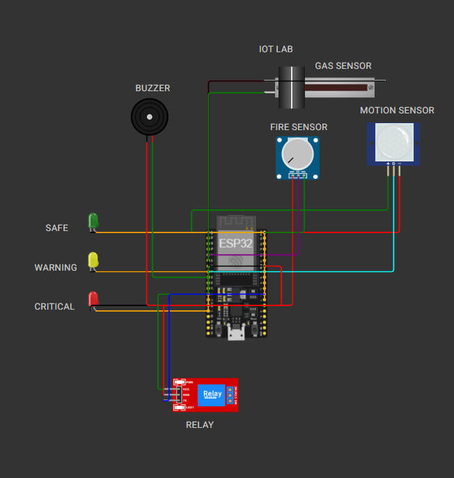

### 2. Server Room Node Circuit Diagram
- **Live Wokwi Simulation**: [https://wokwi.com/projects/470509081717871617](https://wokwi.com/projects/470509081717871617)
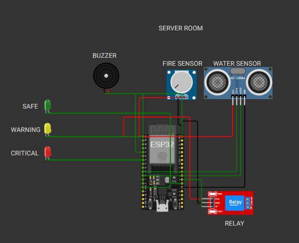

### 3. Data Science Lab Node Circuit Diagram
- **Live Wokwi Simulation**: [https://wokwi.com/projects/470523315735022593](https://wokwi.com/projects/470523315735022593)
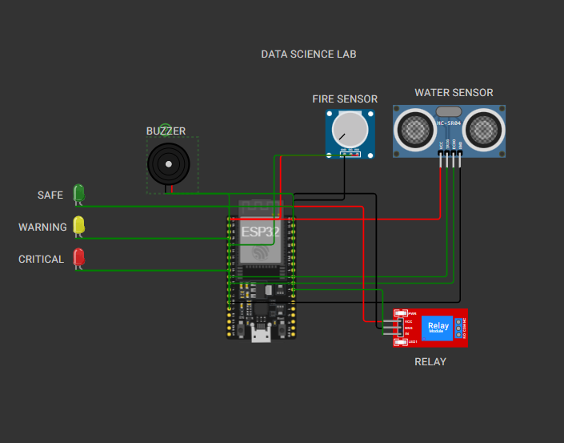

---

## Web Dashboard UI Showcase

### 1. Live Command Dashboard (Dark Mode)
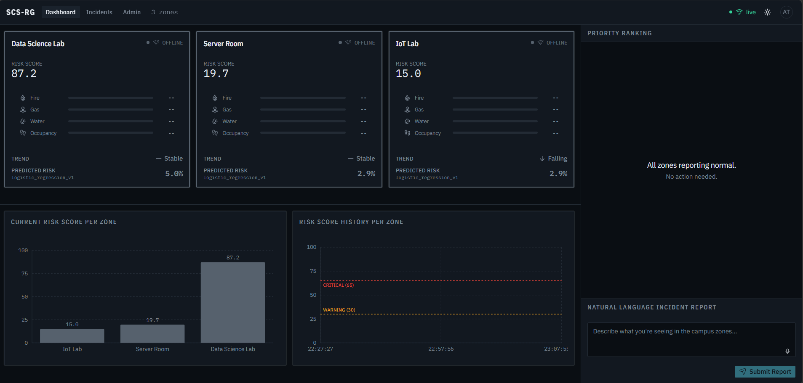

### 2. Live Command Dashboard (Light Mode)
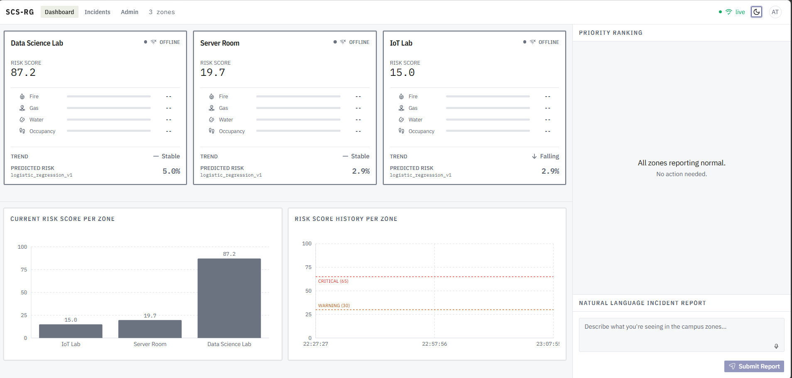

### 3. Priority Dispatch Ledger with Source Provenance Tags
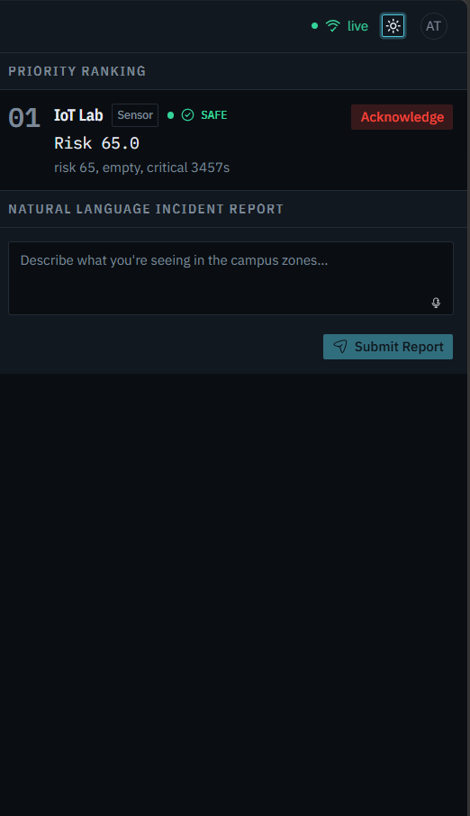

### 4. Natural-Language Incident Reporting Input
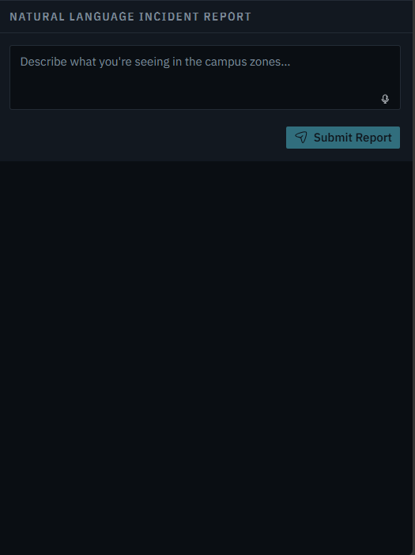

### 5. Filterable Incident History & Transition Timeline
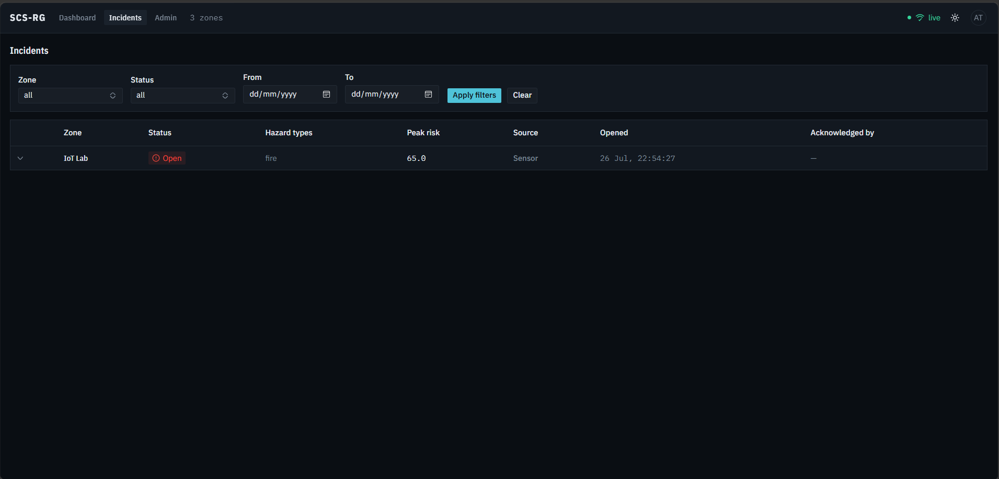

### 6. Admin Zone Control & Manual Override Panel
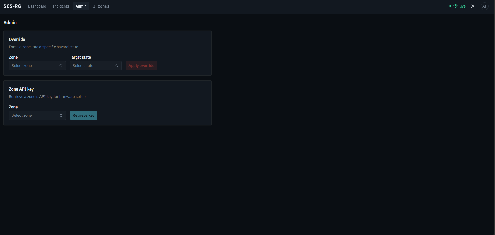

---

## Repository Directory Structure

```
RoboFusion_Techathon_TeamClover/
├── backend/                        # Node.js + Express + Prisma Backend
│   ├── prisma/                     # Database Schema & Seed Scripts
│   │   ├── schema.prisma
│   │   └── seed.ts
│   ├── src/
│   │   ├── app/
│   │   │   ├── config/             # Database, Auth, Socket.io setup
│   │   │   ├── middlewares/        # RBAC, API Key & Request validation
│   │   │   ├── modules/            # Domain modules (readings, zones, incidents, bonus)
│   │   │   └── utils/              # Risk fusion, priority ranking, debounce logic
│   │   └── server.ts               # Application entrypoint & boot recovery
│   └── scripts/                    # Automated verification test suites
├── firmware/                       # Hardware ESP32 Microcontroller Code
│   ├── iot_lab/                    # IoT Lab ESP32 Sketch & Wokwi Diagram
│   ├── server_room/                # Server Room ESP32 Sketch & Wokwi Diagram
│   └── data_science_lab/           # Data Science Lab ESP32 Sketch & Wokwi Diagram
├── frontend/                       # Next.js 16 + React + Tailwind Web App
│   ├── app/                        # App Router (Dashboard, Incidents, Admin, Login)
│   ├── components/                 # UI Components (ZoneMap, DispatchLedger, Charts)
│   ├── hooks/                      # Custom React hooks
│   ├── lib/                        # API client, auth client, format utilities
│   └── providers/                  # Realtime Socket.io & Theme providers
├── docs/                           # System Documentation & Audit reports
│   ├── system_documentation.pdf    # System Documentation PDF
│   └── system_documentation.tex    # System Documentation LaTeX source
└── readme_resources/               # Hardware circuit diagrams, DB ER diagram, and UI screenshots
```

---

## Setup & Local Execution Guide

### Prerequisites
- **Node.js**: v18.x or higher
- **PostgreSQL**: Local instance or remote database (e.g. Supabase / Neon / Render Postgres)

### 1. Backend Setup
```bash
# Navigate to backend directory
cd backend

# Install dependencies
npm install

# Create .env file with your database URL and secrets
cp .env.example .env

# Push database schema & seed initial accounts/zones
npx prisma db push
npx prisma db seed

# Run development backend server (default: http://localhost:4000)
npm run dev
```

### 2. Frontend Setup
```bash
# Navigate to frontend directory
cd frontend

# Install dependencies
npm install

# Create .env.local file
cp .env.example .env.local

# Run Next.js development server (default: http://localhost:3000)
npm run dev
```

### 3. Default User Credentials
| Role | Email | Password |
| :--- | :--- | :--- |
| **Admin** | `admin@uftb.edu.bd` | `Password123!` |
| **Staff** | `staff@uftb.edu.bd` | `Password123!` |

### 4. Resetting Demo State
To restore seeded zone baselines and clear synthetic telemetry/incidents generated during testing:
```bash
cd backend
npm run reset:demo
```

---

## Wokwi Online Simulation Links

To run live hardware telemetry without physical microcontrollers, access the interactive online Wokwi simulations:
- **IoT Lab Node**: [https://wokwi.com/projects/470514529070990337](https://wokwi.com/projects/470514529070990337)
- **Server Room Node**: [https://wokwi.com/projects/470509081717871617](https://wokwi.com/projects/470509081717871617)
- **Data Science Lab Node**: [https://wokwi.com/projects/470523315735022593](https://wokwi.com/projects/470523315735022593)
