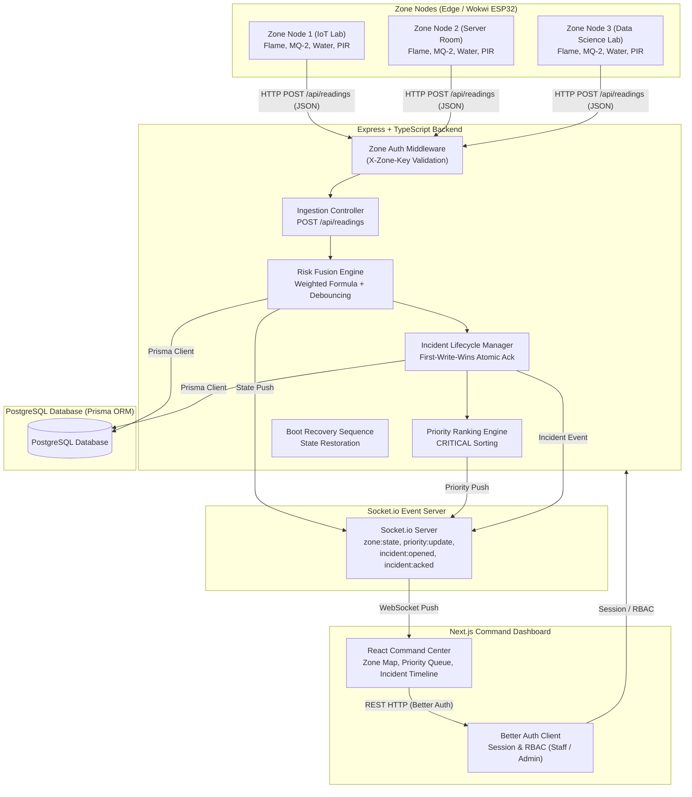

# SCS-RG System Architecture & Data Flow (Test Case 27)

This document describes the software architecture, modular layering, and real-time data pipeline for the **Multi-Hazard Smart Campus Safety & Response Grid (SCS-RG)**.

---

## 1. System Architecture Diagram

---

## 2. Telemetry Processing Pipeline

1. **Ingestion & Validation**:
   - ESP32 nodes POST raw sensor readings every 500ms–1s to `/api/readings` with header `X-Zone-Key`.
   - Middleware validates the key against the database cache.

2. **Server-Side Risk Fusion**:
   - Calculates Risk Fusion Score ($0.0 - 100.0$) using weighted formula:
     $$\text{RiskScore} = w_{fire} \cdot S_{fire} + w_{gas} \cdot S_{gas} + w_{water} \cdot S_{water} + w_{occ} \cdot S_{occ}$$
   - Applies N=5 debouncing, linear decay, and warm-up window evaluation.

3. **Database Persistence & Incident State Machine**:
   - Saves raw reading to PostgreSQL `Reading` table.
   - If `risk_score >= 65.0`, transitions state to `CRITICAL` and opens a new `Incident`.

4. **Real-Time Push Broadcasting**:
   - Socket.io broadcasts `zone:state` and `priority:update` to all connected frontend clients instantly.
