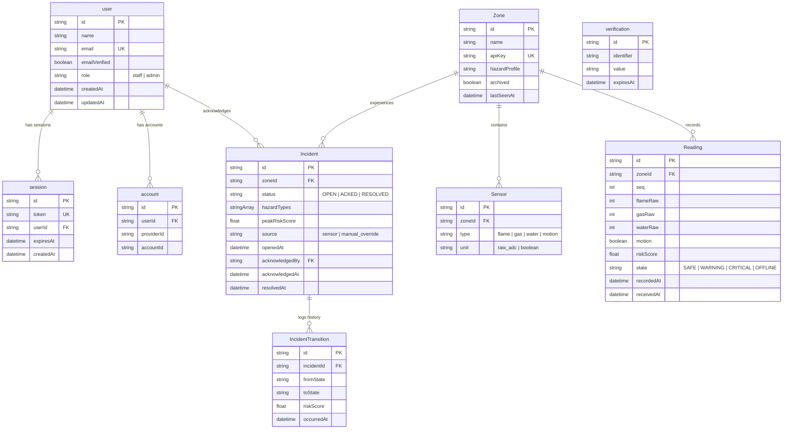

# SCS-RG Database Entity-Relationship Diagram (Test Case 29)

This document presents the complete PostgreSQL Database Entity-Relationship Diagram (ERD) powering the **Multi-Hazard Smart Campus Safety & Response Grid (SCS-RG)**.

---

## 1. Entity-Relationship Diagram

---

## 2. Key Relationships & Index Optimizations

- **`Reading` Composite Index**: `@@index([zoneId, receivedAt])` and `@@unique([zoneId, seq])` for sequence deduplication and time-series range queries.
- **`Incident` Composite Index**: `@@index([status, openedAt])` enabling sub-millisecond query performance for active and historical alert dashboards.
- **Referential Integrity**: `onDelete: Restrict` on `Zone -> Sensor`, `Zone -> Reading`, and `Zone -> Incident` preventing cascading hard-deletes of historical campus data.
